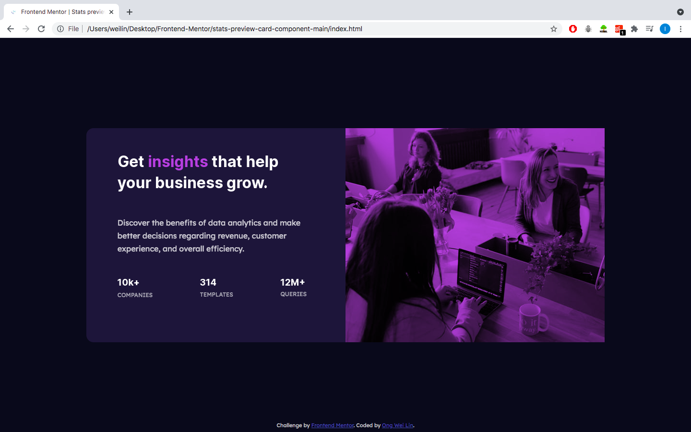

# Frontend Mentor - Stats preview card component solution

This is a solution to the [Stats preview card component challenge on Frontend Mentor](https://www.frontendmentor.io/challenges/stats-preview-card-component-8JqbgoU62). Frontend Mentor challenges help you improve your coding skills by building realistic projects. 

## Table of contents

- [Overview](#overview)
  - [The challenge](#the-challenge)
  - [Screenshot](#screenshot)
  - [Links](#links)
- [My process](#my-process)
  - [Built with](#built-with)
  - [What I learned](#what-i-learned)
  - [Continued development](#continued-development)
  - [Useful resources](#useful-resources)

## Overview

### The challenge

Users should be able to:

- View the optimal layout depending on their device's screen size

### Screenshot

### Links

- Solution URL: https://www.frontendmentor.io/solutions/stats-preview-card-component-using-css-flex-3QXJzKwDh
- Live Site URL: https://weilin93.github.io/stats-preview-card--component/

## My process

### Built with

- Semantic HTML5 markup
- CSS custom properties
- Flexbox

### What I learned

Two main things I have learned working through the project:
1) Flexbox
- I struggled at the start on deciding which one is a more practical tool (Flex or Grid or Table?) to build the layout and make it center. I did a few experiments and ended up sticking with flex for the reasons below:
    - The container has only one row and Flex is more suitable for one-dimensional small-scale layout.
    - Alignment and flexibility are more in control such as wrapping and space between.
2) Color Overlay
- I'm very glad to have come across this problem and learned how to use mix-blend-mode by having an outer div with background image and inner div with color and multiply it.

### Continued development

I had trouble trying to center the container. Justify-content and align-items did not work for my flex-container and I haven't figured out why. I used position method that I found on W3school. I will dive deep into this as well as Flex & Grid and be more comfortable with it.

### Useful resources

- https://www.geeksforgeeks.org/comparison-between-css-grid-css-flexbox/ 
- https://blog.hubspot.com/website/css-grid-vs-flexbox 
- https://www.youtube.com/watch?v=TAA89nkEuhw&t=203s&ab_channel=KevinPowell
- https://22bulbjungle.com/background-image-color-overlay-create-a-filter-look-with-css/
- https://www.w3schools.com/css/css_align.asp 

